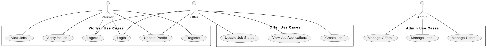

# Requester

Requester is a job recruitment platform designed as a college project. The platform allows workers to search and apply for jobs, while companies can post job offers and manage applications. The project is built using Django and leverages Docker for containerization.

## Class Diagrams

The class diagram for the project outlines the main entities and their relationships:

- **User**: Represents a user of the platform, which can be either a worker or a company offering jobs.
- **Worker**: Contains personal information about the worker, such as name, email, phone number, address, and date of birth.
- **JobRequest**: Represents a job application submitted by a worker, including the resume, cover letter, status, and timestamps.
- **Offer**: Represents a job offer posted by a company, including company details and job information.
- **Job**: Represents a job listing, including job name, details, and timestamps.
- **Tag**: Represents tags associated with jobs for categorization.

The relationships between these entities are as follows:

- A User can have one Worker profile and one Offer profile.
- A Worker can submit multiple JobRequests.
- A Job can receive multiple JobRequests.
- An Offer can post multiple Jobs.
- A Job can be tagged with multiple Tags.

## Use Case Diagrams

The use case diagram illustrates the interactions between different actors (Worker, Offer, Admin) and the system:

- **Worker Use Cases**:
  - Login
  - Logout
  - Register
  - View Jobs
  - Apply for Job
  - Update Profile

- **Offer Use Cases**:
  - Login
  - Logout
  - Register
  - Create Job
  - View Job Applications
  - Update Job Status
  - Update Profile

- **Admin Use Cases**:
  - Manage Users
  - Manage Jobs
  - Manage Offers

## Sequence Diagram

The sequence diagram below illustrates the interactions between different actors (Worker, Employer, Admin) and the system:

- **Worker**:
  - Logs into the system.
  - Views job postings.
  - Submits job applications (resume and cover letter).

- **Employer**:
  - Creates new job postings.
  - Views job applications.

- **Admin**:
  - Manages users.
  - Manages job postings.
  - Manages employers.

## Activity Diagram

The activity diagram below shows the workflow of the job application process:

- **Worker**:
  - Registers on the platform.
  - Searches for job postings.
  - Applies for a job.

- **Employer**:
  - Posts a new job.
  - Reviews job applications.
  - Updates job status.

- **Admin**:
  - Oversees platform activities.
  - Manages user accounts.
  - Manages job postings.

## Required Tools

To run and develop this project, you will need the following tools:

- **Docker**: Used for containerizing the application and its dependencies.
- **Docker Compose**: Used to define and run multi-container Docker applications.
- **Python 3.10**: The programming language used for the project.
- **pipenv**: Used for package manager for python.
- **Django**: The web framework used to build the application.
- **MySQL**: The database used to store application data.
- **Redis**: Used for caching and message brokering.
- **Elasticsearch**: The Search engin service.
- **MmailServer**: The TestMail service.
- **Ollama**: The LLM service.

## Makefile Commands

### Usage

- `make run` - Run the Django development server
